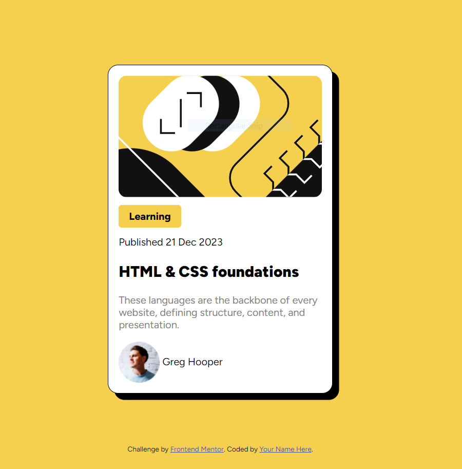

# Frontend Mentor - Blog preview card solution

This is a solution to the [Blog preview card challenge on Frontend Mentor](https://www.frontendmentor.io/challenges/blog-preview-card-ckPaj01IcS). Frontend Mentor challenges help you improve your coding skills by building realistic projects. 

## Table of contents

- [Overview](#overview)
  - [Screenshot](#screenshot)
  - [Links](#links)
- [My process](#my-process)
  - [Built with](#built-with)
- [Author](#author)

## Overview

### Screenshot

### Links

- Solution URL: https://github.com/Litheesh-kumar/css-practice/tree/main/blog-preview-card-main
- Live Site URL: https://litheesh-kumar.github.io/css-practice/blog-preview-card-main

## My process

### Built with

- Semantic HTML5 markup
- CSS custom properties
- Flexbox
- CSS Grid
- Desktop-first workflow

## Author

- Website - [Litheesh Kumar](https://www.your-site.com)
- Frontend Mentor - [@Litheesh-kumar](https://www.frontendmentor.io/profile/Litheesh-kumar)
